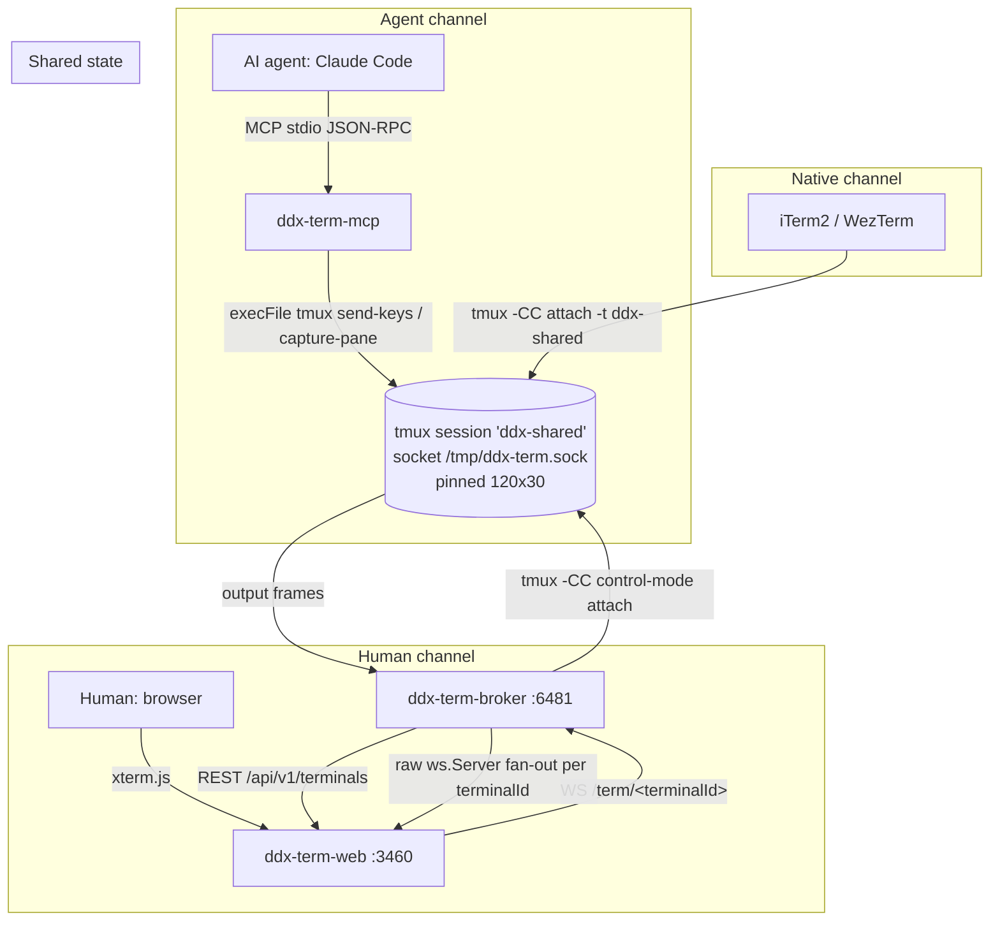

# Architecture

## The one-line model

A single pinned-size `tmux` session is the **canonical shared state**. Every party
writes through tmux; **none of them holds a PTY of its own** except the broker
(which holds the control-mode attach). Because all output originates from the same
tmux session, a command the agent types is visible live in the web UI, in a native
iTerm2/WezTerm tab, and to any other observer — simultaneously.

- Session name: `ddx-shared` (env `DDX_TERM_SESSION`)
- Socket: `/tmp/ddx-term.sock` (env `DDX_TERM_SOCKET`, tmux `-S`)
- Pinned geometry: **120 × 30** (set by the broker; no client renegotiation)

A **terminal** is a tmux **window** inside that session, addressed by a stable
`terminalId` (e.g. `t01`). See the [glossary](./glossary.md) for `terminalId` vs `pid`.

## The three channels

| Channel | Actor | Package | Transport | How it touches tmux |
|---|---|---|---|---|
| **Human** | Browser user | `ddx-term-web` (xterm.js) | WS `/term/<terminalId>` → broker | Broker writes to tmux via control-mode |
| **Agent** | Claude Code / Desktop | `@dudoxx/ddx-term-mcp` | MCP stdio (JSON-RPC 2.0) | `execFile(tmux …)` — thin client, **no PTY** |
| **Native** | iTerm2 / WezTerm | (none — standard tmux) | `tmux -CC attach -t ddx-shared` | Direct control-mode client |

The native channel needs no Dudoxx code: the bridge **is** a standard tmux session,
so any tmux `-CC` control-mode client renders the shared terminals as native tabs.

## Package roles

- **`@ddx/term-contract`** — zod/v4 schemas for WS frames, MCP tool I/O, and
  terminal/session descriptors. Zero runtime logic; the single source of truth that
  the broker, MCP, and web all import. Types are never duplicated downstream.
- **`ddx-term-broker`** — NestJS 11, port **6481**. Attaches to tmux in control-mode
  (`tmux -CC`), owns the `terminalId ↔ windowId` registry, exposes REST CRUD at
  `/api/v1/terminals`, and fans per-terminal output over a raw `ws.Server` (NOT
  `@WebSocketGateway` — see broker doc for why). On restart it runs
  `reconcileRegistry()` to re-adopt live windows from tmux — **the session is never
  killed**.
- **`@dudoxx/ddx-term-mcp`** — MCP stdio server. A thin tmux client via `execFile`
  with **zero `node-pty`** (enforced by `no-pty.spec.ts`). Exposes 10 verbs.
- **`ddx-term-web`** — Next.js 16 App Router, port **3460**. Opens **one WS per
  terminalId** (`/term/<terminalId>`). A tab switch is a WS resubscribe + snapshot
  restore — NOT a full reconnect.

## Data-flow diagram

## WebSocket frame model

All WS frame shapes are zod schemas in
`packages/ddx-term-contract/src/ws-frames.ts` (a discriminated union). The broker
parses tmux control-mode output into these frames and fans them to the matching
per-terminal WS subscribers. The agent does not use WS — it reads output via
`term_read` (scrollback delta) or `term_snapshot` (visible viewport grid).

## Restart semantics

The broker is the only component that may restart without disrupting the others.
On boot, `reconcileRegistry()` walks the live tmux windows and re-adopts them into
the `terminalId ↔ windowId` registry. The tmux session outlives every process —
it is the durable state, and the broker/web/MCP are stateless views onto it.

## See also

- [Glossary](./glossary.md) — terms used above.
- [Broker package](../02-packages/broker.md) — control-mode internals + `reconcileRegistry`.
- [Invariants](../04-development/invariants.md) — the rules this model depends on.

---
Dudoxx UG / Acceleate Consulting - Walid Boudabbous <walid@acceleate.com>
